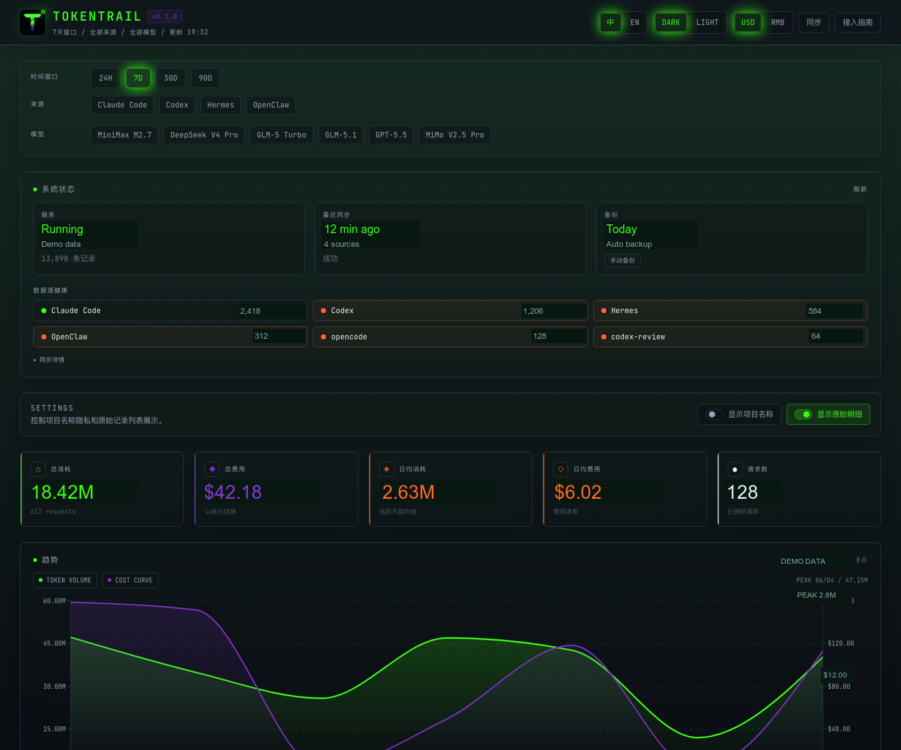

# TokenTrail

<div align="center">

**Local-first AI token usage dashboard for Claude Code, Codex, and custom AI tools.**

[English](./README.md) | [中文](./README.zh-CN.md)

</div>

---

TokenTrail helps developers understand where their AI coding tokens go. It reads local usage data from Claude Code and Codex, accepts usage reports from other tools, stores everything in SQLite on your machine, and turns it into a dashboard for cost trends, model breakdowns, source health, project attribution, and raw-record inspection.



## Why TokenTrail

- **Local-first by default** — usage data stays on your machine; no cloud account is required.
- **Built for AI coding workflows** — tracks Claude Code, Codex, and any tool that integrates via the included SDK or HTTP API.
- **Cost and token visibility** — compare spend by day, model, source, and project instead of guessing from provider bills.
- **Inspectable data** — review raw records, sync results, duplicate counts, and source health when numbers look suspicious.
- **Background sync on macOS** — LaunchAgent keeps the dashboard and sync job running after login.
- **Privacy-friendly project display** — project names can be hidden in the dashboard when you want a safer screen-share view.

## What You Get

| Area | What it shows |
| --- | --- |
| Usage dashboard | Daily/monthly token and cost trends, model mix, source comparison |
| Project stats | Usage by project, with optional project-name hiding |
| Source health | Claude Code, Codex, API sync status, last sync result, duplicate/error counts |
| Raw records | Searchable usage records for auditing and debugging |
| Pricing | Built-in model pricing table and auto-registration for unknown models |
| API and CLI | Report custom usage from scripts, agents, local services, or other tools |

## Quick Start

### 1. Install and run locally

```bash
git clone https://github.com/shengshuyuan/TokenTrail.git
cd TokenTrail
npm install
npm run dev
```

Open **http://localhost:3820**.

### 2. Configure and sync

```bash
npm run setup
npm run sync
```

This scans Claude Code logs (`~/.claude/projects/`), Codex sessions (`~/.codex/sessions/`), and optional VibeCafe-compatible usage data.

### 3. Install the macOS background service

```bash
npm run install-service
npm run doctor
```

The service creates a runtime copy under `~/.tokentrail/runtime/TokenTrail`, keeps the dashboard available on port `3820`, and runs scheduled sync in the background.

## Data Sources

TokenTrail is self-contained. It collects data in two ways: automatic local file scanning, and active reporting via the included SDK or HTTP API. No external services are required.

### Automatic local scan

TokenTrail reads usage records directly from local files. The source tools do not need to know about TokenTrail.

| Tool | Files scanned |
| --- | --- |
| Claude Code | `~/.claude/projects/*/sessions/*.jsonl` |
| Codex | `~/.codex/sessions/**/*.jsonl` |

### SDK and API integration for other tools

For tools whose usage data is not available as local files (OpenClaw, Hermes, Lobster, custom agents, etc.), TokenTrail provides a lightweight SDK and a plain HTTP API. The source tool reports usage directly to TokenTrail — no third-party service involved.

#### Option 1: `tokentrail-report` npm package (recommended)

Zero-dependency SDK. Auto-discovers the TokenTrail endpoint via the `TOKENTRAIL_URL` environment variable (defaults to `http://localhost:3820`).

```bash
npm install tokentrail-report
```

```js
const { report } = require('tokentrail-report')

await report({
  source: 'openclaw',
  model: 'gpt-4.1',
  input_tokens: 5000,
  output_tokens: 1200,
  project: 'my-project',
})
```

#### Option 2: Wrap an OpenAI-compatible client

If the tool uses an OpenAI-compatible SDK, wrap it once and every `chat.completions.create()` call automatically reports usage.

```js
const OpenAI = require('openai')
const { wrapOpenAI } = require('tokentrail-report')

const openai = wrapOpenAI(new OpenAI(), { source: 'openclaw' })

// Usage is now reported automatically on every call
const res = await openai.chat.completions.create({ model: 'gpt-4.1', messages: [...] })
```

#### Option 3: Plain HTTP API

Any tool that can make an HTTP request can report usage directly.

```bash
curl -X POST http://localhost:3820/api/report \
  -H 'Content-Type: application/json' \
  -d '{"source":"openclaw","model":"gpt-4.1","input_tokens":5000,"output_tokens":1200}'
```

Minimal API payload:

```json
{
  "source": "custom-agent",
  "model": "gpt-4.1",
  "input_tokens": 5000,
  "output_tokens": 1200,
  "request_id": "unique-id-for-dedup",
  "project": "my-project",
  "timestamp": 1718000000000
}
```

`source`, `model`, and `input_tokens` are required. `request_id` is recommended for deduplication. Unknown models are created with price `$0` until you update pricing through the pricing API.

#### Option 4: Local OpenAI-compatible proxy (zero code changes)

If the tool supports changing the OpenAI `baseURL`, point it to TokenTrail's local proxy. TokenTrail forwards requests to the real API and records usage automatically — the tool needs zero code changes.

```bash
# Set the base URL in your tool's config
OPENAI_BASE_URL=http://localhost:3820/proxy/openai
```

Or in code:

```js
const openai = new OpenAI({ baseURL: 'http://localhost:3820/proxy/openai' })
```

TokenTrail uses the caller's `Authorization` header to forward to the upstream API. You can also set `OPENAI_API_KEY` in the environment or in `~/.tokentrail/config.json`.

To identify the source, add a custom header:

```bash
curl http://localhost:3820/proxy/openai/v1/chat/completions \
  -H "Authorization: Bearer $OPENAI_API_KEY" \
  -H "x-tokentrail-source: hermes" \
  -H "Content-Type: application/json" \
  -d '{"model":"gpt-4.1","messages":[{"role":"user","content":"hello"}]}'
```

#### Environment variable

Set `TOKENTRAIL_URL` so the SDK and tools can auto-discover the TokenTrail endpoint:

```bash
export TOKENTRAIL_URL=http://localhost:3820
```

If not set, the SDK defaults to `http://localhost:3820`.

### Optional: VibeCafé API

If you have a VibeCafé account, TokenTrail can also pull usage data from the VibeCafé API. This is a convenience for existing VibeCafé users — it is not required. Add the API key to `~/.tokentrail/config.json`:

```json
{
  "server_url": "http://localhost:3820",
  "vibecafe_api_key": "your-api-key"
}
```

## CLI Commands

| Command | Description |
| --- | --- |
| `npm run setup` | Configure CLI and test server connection |
| `npm run sync` | Sync all data sources now |
| `npm run status` | Show server status and data statistics |
| `npm run doctor` | Run full local health diagnosis |
| `npm run open` | Open the dashboard in your browser |
| `npm run backup` | Create a manual SQLite database backup |
| `npm run restart` | Restart the persistent service |
| `npm run install-service` | Install macOS LaunchAgent service |
| `npm run uninstall-service` | Remove service while preserving data |

## Architecture

```text
TokenTrail/
├── bin/tokentrail.js          # CLI
├── scripts/serve.js           # Local server entry
├── packages/
│   └── tokentrail-report/     # Lightweight SDK for tools to report usage
├── src/
│   ├── app/
│   │   ├── api/
│   │   │   ├── proxy/openai/  # Local OpenAI-compatible proxy
│   │   │   ├── report/        # Usage report endpoint
│   │   │   ├── sync/          # Data sync trigger
│   │   │   └── ...            # health, status, stats, backup, pricing
│   │   └── ...
│   ├── components/dashboard/  # Dashboard UI
│   └── lib/
│       ├── db.ts              # SQLite data layer
│       ├── sync.ts            # Multi-source sync engine
│       └── pricing.ts         # Cost calculation
└── data/token-trail.db        # Local SQLite database, gitignored
```

## Local Files

| Path | Description |
| --- | --- |
| `~/.tokentrail/config.json` | CLI configuration |
| `~/.tokentrail/runtime/TokenTrail/` | Runtime copy isolated from project/cloud-sync paths |
| `~/.tokentrail/backups/` | Database backups |
| `~/.tokentrail/logs/` | Service and sync logs |
| `~/Library/LaunchAgents/*tokentrail*` | macOS service definitions |
| `data/token-trail.db` | Project-local SQLite database |

## Troubleshooting

```bash
npm run doctor      # Check server, database, service, sync, and config
npm run sync        # Run a manual sync
npm run restart     # Restart the persistent macOS service
```

If data looks wrong, check the raw records and sync result first. TokenTrail keeps duplicate/error counts visible so you can distinguish missing data, duplicate imports, and pricing gaps.

## Tech Stack

- Next.js 14, React 18, Recharts, Tailwind CSS
- SQLite via better-sqlite3
- macOS LaunchAgent for the optional persistent service
- Node.js CLI with no external CLI framework dependency

## License

MIT
