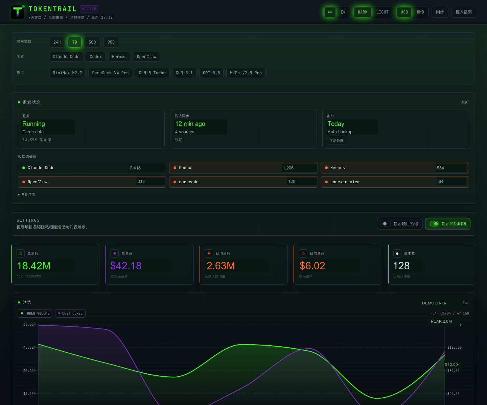

# TokenTrail

<div align="center">

**本地优先的 AI 编程用量面板：既统计 token 花费，也跟踪 Codex、Gemini、Grok、GLM、Kimi 的账号额度。**

[English](./README.md) | [中文](./README.zh-CN.md)

</div>

---

TokenTrail 是跑在你电脑上的 AI 编程用量面板，不需要云账号。它做两件事：

1. **用量统计**：从 Claude Code、Codex、Kimi Code、Grok 以及任何通过 JSONL / CLI / HTTP 上报的工具读取真实 token 数，存进本机 SQLite，展示费用趋势、模型分布、项目归因、来源健康和原始记录。
2. **账号额度**：查看 Codex、Gemini、Grok、GLM Coding Plan、Kimi Code 的官方剩余额度（5 小时 / 每周窗口、加油包、重置倒计时）。授权优先走各家官方 CLI 的可见终端登录；API Key 只作兜底，且不同产品的 Key 不会混用。



## 0.3.0 更新了什么

账号额度中心现在和用量统计并列，是 Dashboard 的一等功能。

- 同一块面板既能看 **已经花了多少 token**，也能看 **官方订阅还剩多少**
- Codex / Gemini / Grok / Kimi 登录会打开可见的 macOS 终端，跑官方 CLI（`codex login`、`gemini`、`grok login --oauth`、`kimi login`）；GLM 使用 Coding Plan Token
- API Key 只作兜底，存在 macOS 钥匙串，不会写入 SQLite 快照
- 产品边界写死：ChatGPT 登录 ≠ OpenAI API Key；Grok OAuth ≠ Management Key；Kimi Code ≠ Moonshot 钱包；Gemini 已登录但没有 GCP 配额项目时显示已登录，而不是假的 0%

完整更新说明见 [CHANGELOG.md](./CHANGELOG.md)。

## 为什么需要 TokenTrail

- **默认本地优先**：用量数据留在你的电脑上，不需要云账号。
- **用量和额度放在一起**：既能看已经花了多少，也能看官方订阅还剩多少。
- **官方登录优先**：Codex / Gemini / Grok / Kimi 授权会打开真正的 CLI（`codex login`、`gemini`、`grok login --oauth`、`kimi login`）。不抓 Cookie，不编造数字。
- **密钥不进快照**：界面里填的 API Key 进 macOS 钥匙串；SQLite 只保存 Team ID、Project ID、Base URL 和规范化额度快照。
- **数据可检查**：可以查看原始记录、同步结果、重复数、错误数和来源健康状态。
- **macOS 后台常驻**：通过 LaunchAgent 登录后自动启动服务和定时同步。
- **隐私友好的项目展示**：录屏或共享屏幕时可以隐藏项目名称。

## 你能看到什么

| 模块 | 展示内容 |
| --- | --- |
| 账号额度中心 | Codex、Gemini、Grok、GLM、Kimi 的官方剩余额度：5 小时/每周窗口、加油包、重置倒计时、CLI 登录、钥匙串存 Key |
| 用量 Dashboard | 日/月 token 和费用趋势、模型分布、来源对比 |
| 项目统计 | 按项目查看消耗，并支持隐藏项目名称 |
| 来源健康 | Claude Code、Codex、API 同步状态、最近同步结果、重复/错误数量 |
| 原始记录 | 可追溯的用量明细，方便审计和排查 |
| 模型定价 | 内置常见模型价格，未知模型自动注册 |
| API 和 CLI | 让脚本、Agent、本地服务或其他工具主动上报用量 |

## 它怎么工作

TokenTrail 在同一台电脑上跑两条流水线。它们共用 Dashboard，不共用数据模型。

**用量**回答「已经花了多少？」
扫描 Claude Code / Codex / Kimi Code 的本地 JSONL，也可读其他工具写的 JSONL，或走 `POST /api/report`、OpenAI 兼容本地代理。记录写入 SQLite `usage_records`，并按价目表算费用。

**额度**回答「官方套餐还剩多少？」
每家 Provider 在 `src/lib/quotas/providers/` 有独立适配器。适配器读官方 CLI 登录态或官方接口，再把规范化快照（`windows`、`boosters`、`status`、`source`）写入 `quota_snapshots`。凭证不会进这张表。

可能看到的状态：

| 状态 | 含义 |
| --- | --- |
| `healthy` | 官方数据，用量未到告警线 |
| `warning` / `critical` / `exhausted` | 窗口大约用到 80% / 95% / 100% |
| `auth_error` | 登录过期或被拒绝，需要重新登录 |
| `not_configured` | 没有 CLI 登录，也没有可用 Key |
| `unsupported` | 已登录，但这个账号没有可读额度（例如 Gemini 没有 GCP 配额项目） |
| `unsupported_version` | 官方返回结构变了——TokenTrail 不会编造百分比 |
| `stale` / `network_error` | 保留上次成功快照；刷新失败或数据过旧 |
| `manual` | 你自己录入的数字 |

## 快速开始

### 1. 安装并本地运行

```bash
git clone https://github.com/shengshuyuan/TokenTrail.git
cd TokenTrail
npm install
npm run dev
```

打开 **http://localhost:3820**。

### 2. 初始化并同步

```bash
npm run setup
npm run sync
```

这会扫描 Claude Code 日志（`~/.claude/projects/`）、Codex 会话（`~/.codex/sessions/`）、Kimi Code 会话（`~/.kimi-code/sessions/` 及兼容的 `~/.kimi/sessions/`），以及可选的 VibeCafe 兼容用量数据。

### 3. 安装 macOS 后台服务

```bash
npm run daemon-install
npm run daemon-status
```

服务会在 `~/.tokentrail/runtime/TokenTrail` 创建运行副本，让 Dashboard 常驻在 `3820` 端口，并在后台定时同步数据。

> 旧命令 `npm run install-service`、`npm run uninstall-service`、`npm run restart`、`npm run doctor` 仍然可用，`daemon-*` 系列只是更易读的别名。

## 数据来源

TokenTrail 完全自包含，不依赖外部平台。

### 本地扫描（自动，无需接入）

| 工具 | 扫描路径 |
| --- | --- |
| Claude Code | `~/.claude/projects/*/sessions/*.jsonl` |
| Codex | `~/.codex/sessions/**/*.jsonl` |
| Kimi Code | `~/.kimi-code/sessions/**/wire.jsonl` 和 `~/.kimi/sessions/**/wire.jsonl` |

### 其他工具（需要接入）

OpenClaw、Hermes 及其他工具，必须在每次模型调用完成后写一行 JSONL 到 `~/.<工具名>/usage/YYYY-MM-DD.jsonl`。TokenTrail 同步时自动扫描。

> **不需要 server URL / 邮箱 / API Key。** TokenTrail 是纯本地服务。写 JSONL 文件零配置、零网络；CLI（`tokentrail report`）和 HTTP（`POST /api/report`）两种替代方式也都免鉴权——无需注册账号，无需提供任何凭据。

**核心规则：** 在模型响应完成后读取真实 `response.usage`。没有 usage 数据就跳过，不要写 0。

标准格式：

```json
{"source":"openclaw","provider":"xiaomi","model":"mimo-v2.5-pro","input_tokens":5000,"output_tokens":1200,"request_id":"id","timestamp":1718000000000}
```

| 字段 | 必填 | 说明 |
| --- | --- | --- |
| `source` | 是 | 工具名（`openclaw`、`hermes` 等） |
| `provider` | 是 | 模型服务商（`openai`、`anthropic`、`xiaomi` 等） |
| `model` | 是 | 响应中的实际模型 ID，不要写死 |
| `input_tokens` | 是 | 真实输入 token 数 |
| `output_tokens` | 是 | 真实输出 token 数 |
| `cached_input_tokens` | 否 | 默认 0 |
| `reasoning_tokens` | 否 | 默认 0 |
| `request_id` | 建议 | 用于去重，优先用 provider response ID |
| `project` | 否 | 项目/工作区名称 |
| `timestamp` | 否 | Unix 毫秒，默认当前时间 |

Node.js 辅助函数：

```js
const fs = require('fs')
const path = require('path')

function reportUsage(toolName, data) {
  if (!data.input_tokens && !data.output_tokens) return
  const dir = path.join(process.env.HOME, `.${toolName}`, 'usage')
  fs.mkdirSync(dir, { recursive: true })
  fs.appendFileSync(
    path.join(dir, `${new Date().toISOString().slice(0, 10)}.jsonl`),
    JSON.stringify(data) + '\n'
  )
}

// 模型响应完成后
reportUsage('openclaw', {
  source: 'openclaw',
  provider: 'xiaomi',
  model: response.model,
  input_tokens: response.usage.prompt_tokens,
  output_tokens: response.usage.completion_tokens,
  request_id: response.id,
  timestamp: Date.now()
})
```

Hermes 用 `reportUsage('hermes', { ... })`。

### 替代方式（适用于 SDK 工具）

OpenAI 兼容 SDK 可以直接包装：

```js
const { wrapOpenAI } = require('tokentrail-report')
const client = wrapOpenAI(new OpenAI(), { source: 'hermes' })
```

或把 `baseURL` 指向本地代理（零代码改动）：

```bash
OPENAI_BASE_URL=http://localhost:3820/proxy/openai
```

### 总结

| 工具 | 方式 |
| --- | --- |
| Claude Code | TokenTrail 扫描本地 JSONL（自动） |
| Codex | TokenTrail 扫描本地 JSONL（自动） |
| Kimi Code | TokenTrail 扫描本地 Wire 用量事件（自动） |
| OpenClaw / Hermes / 其他 | 每次调用后写 `~/.工具名/usage/*.jsonl` |

### 可选：VibeCafé API

给已有 VibeCafé 账号的用户提供的便利功能，不是主要接入方式。**`vibecafe_api_key` 只用于拉取 VibeCafé 历史——Hermes / OpenClaw / Codex / Claude Code 都不需要任何 API Key。** 在 `~/.tokentrail/config.json` 添加 API Key：

```json
{ "server_url": "http://localhost:3820", "vibecafe_api_key": "your-api-key" }
```

## 账号额度中心

Dashboard 顶部打开 **「账号额度」**。TokenTrail 不编造剩余额度：只展示官方 CLI/会话数据、官方接口，或你自己录入的快照。

| Provider | 怎么登录 | 能自动读什么 | API Key 是干什么的 |
| --- | --- | --- | --- |
| **Codex** | 可见终端运行 `codex login`（ChatGPT） | `~/.codex/sessions` 里的 5 小时 / 每周窗口 | 普通 OpenAI API Key ≠ ChatGPT/Codex 订阅额度 |
| **Gemini** | 可见终端运行 `gemini`，选 Sign in with Google | 账号有可读 GCP 项目时的官方模型额度桶 | AI Studio Key 推不出 Google AI Pro/Ultra 剩余额度 |
| **Grok** | 可见终端运行 `grok login --oauth` | 复用 Grok CLI OAuth 读订阅 Credits / 月度用量 | Management Key + Team ID 是 xAI API 预付/账单，不是 Grok 网页订阅 |
| **GLM** | Coding Plan Token / `ANTHROPIC_AUTH_TOKEN` | Coding Plan 5 小时窗口和官方 MCP 用量 | 只有能调 Coding Plan monitor 接口的 Token 才行 |
| **Kimi** | 可见终端运行 `kimi login`，或填 **Kimi Code** 控制台 Key | Kimi Code `/coding/v1/usages` 窗口和加油包 | Moonshot 开放平台 Key 只读开放平台钱包，不能和 Kimi Code Key 混用 |

如果 TokenTrail 没能打开授权窗口，自己在终端跑同一条官方命令，再回到额度中心刷新：

```bash
codex login
gemini          # 选择 Sign in with Google
grok login --oauth
kimi login
```

Kimi OAuth 过期会显示鉴权失效并要求重新登录。Gemini 已登录但没有 GCP 配额项目时，会显示已登录，而不是假的 0%。Grok CLI 账单结构变化会显示「版本待升级」，不会把登录成功说成额度读取成功。

界面里填的 API Key 保存在 **macOS 钥匙串**。SQLite 只保存 Team ID / Project ID / Base URL 和规范化快照。快照里不会出现 token、邮箱或账号 ID。

完整说明见 [docs/QUOTA_MANUAL_GUIDE.md](./docs/QUOTA_MANUAL_GUIDE.md)。

## 隐私

- 没有 TokenTrail 云账号
- 用量只存在本地 SQLite（`data/token-trail.db`）
- 额度相关 API Key 只进 macOS 钥匙串
- 额度快照只保存剩余额度和状态，不含 token、邮箱或账号 ID
- CLI 登录是各家自己的进程，跑在可见终端里；TokenTrail 不抓 Cookie，也不编造数字

## CLI 命令

| 命令 | 说明 |
| --- | --- |
| `npm run setup` | 初始化 CLI 配置并测试服务器连接 |
| `npm run sync` | 立即同步所有数据源 |
| `npm run status` | 查看服务器状态和数据统计 |
| `npm run doctor` | 运行完整本地健康诊断 |
| `npm run open` | 在浏览器中打开 Dashboard |
| `npm run backup` | 手动备份 SQLite 数据库 |
| `npm run restart` | 重启 macOS 常驻服务 |
| `npm run install-service` | 安装 macOS LaunchAgent 服务 |
| `npm run uninstall-service` | 移除服务但保留数据 |

## 项目结构

```text
TokenTrail/
├── bin/tokentrail.js          # CLI
├── scripts/serve.js           # 本地服务入口
├── packages/
│   └── tokentrail-report/     # 轻量 SDK，供其他工具上报用量
├── src/
│   ├── app/
│   │   ├── api/
│   │   │   ├── quotas/        # 账号额度读取 / 刷新 / 授权
│   │   │   ├── proxy/openai/  # 本地 OpenAI 兼容代理
│   │   │   ├── report/        # 用量上报端点
│   │   │   ├── sync/          # 数据同步触发
│   │   │   └── ...            # health, status, stats, backup, pricing
│   │   └── ...
│   ├── components/dashboard/  # Dashboard UI（含额度中心）
│   └── lib/
│       ├── db.ts              # SQLite 数据层
│       ├── sync.ts            # 多来源用量同步
│       ├── quotas/            # 额度适配器、状态机、CLI 登录、钥匙串
│       │   ├── providers/     # codex / gemini / grok / glm / kimi
│       │   ├── cli-login.js   # 可见 macOS 终端跑官方登录
│       │   └── secret-store.ts
│       └── pricing.ts         # 费用计算
└── data/token-trail.db        # 本地 SQLite 数据库，已 gitignore
```

## 本地文件位置

| 路径 | 说明 |
| --- | --- |
| `~/.tokentrail/config.json` | CLI 配置文件 |
| `~/.tokentrail/runtime/TokenTrail/` | 与项目/云同步目录隔离的运行副本 |
| `~/.tokentrail/backups/` | 数据库备份 |
| `~/.tokentrail/logs/` | 服务和同步日志 |
| `~/Library/LaunchAgents/*tokentrail*` | macOS 服务定义文件 |
| `data/token-trail.db` | 项目本地 SQLite 数据库 |

## 故障排查

```bash
npm run doctor      # 检查服务、数据库、常驻任务、同步和配置
npm run sync        # 手动同步一次
npm run restart     # 重启 macOS 常驻服务
```

如果数据看起来不对，优先查看原始记录和同步结果。TokenTrail 会展示重复数和错误数，方便区分数据缺失、重复导入和模型定价缺口。

## 技术栈

- Next.js 14、React 18、Recharts、Tailwind CSS
- SQLite（better-sqlite3）
- macOS LaunchAgent 可选常驻服务
- Node.js CLI，无外部 CLI 框架依赖

## 许可证

MIT
