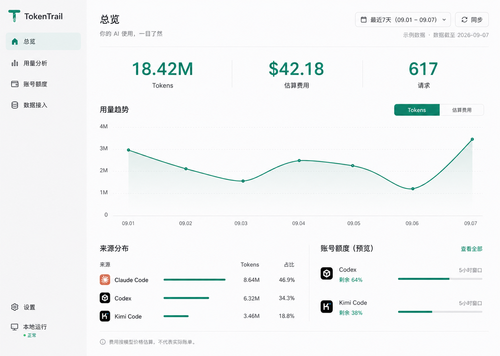

# TokenTrail 界面重新设计方案

日期：2026-09-07。交付范围：设计与实现计划，不进行产品代码开发。

## 设计判断

把 TokenTrail 定位为个人 AI 用量工作台。首屏回答：用了多少、主要用在哪里、还有多少额度。设计质量来自清晰的信息优先级、可信的数据语义、统一的交互和精确排版。

依据：当前 src/app/page.tsx、dashboard 组件、类型契约和仓库历史截图 docs/assets/tokentrail-dashboard.png。历史截图不是当前运行截图：当前源码已将 KPI 提前、系统状态默认折叠，但首页仍同时承载筛选、设置、图表、明细；页头还聚集语言、主题、币种、同步、额度、接入和分享。本次未检查运行中的 UI。

重新设计的核心是拆分任务与重新建立页面骨架，不在旧主题上叠加 CSS。

## 设计稿与推荐方向

推荐这张浅色工作台作为下一版基础：固定侧栏、连续主内容表面、无边框指标区、大幅趋势、底部来源与额度摘要。绿色用于主操作、选中状态和核心数据；正文保持中性色。

这是一张 AI 生成的概念位图，不是实际界面截图、可编辑 Figma 文件或已实现页面。数据均为示例。第二张生成时工具返回 usage_limit_reached，因此只交付一张图片。

落地时需校正的细节：

- 图中的品牌图标属于生成近似，正式实现使用经过确认的品牌资产。
- 图中曲线为视觉示意，点值不用于校验 18.42M 总量；正式图表从 daily 数据绘制，并与指标保持同一范围。
- Kimi、Codex 的窗口名称和剩余额度必须来自实际快照，不能固定套用图上的 5 小时窗口。
- 三个指标应适当拉开优先级：总用量可用绿色，费用和请求数使用深灰，避免所有数字同样抢眼。
- 图中百分比保留一位小数，四舍五入后的占比可能不恰好合计 100%，不人为修改数据。

另外两个备选方向仅有文字方案：深色分析台采用顶部导航、主趋势与右侧贡献列表、底部明细，适合频繁分析；额度优先的账户中心以供应商列表和详情面板为主体，突出剩余量、重置时间、更新状态和修复入口，适合额度管理。后者会弱化 TokenTrail 的用量分析定位，不建议作为默认首页。

## 信息架构

| 页面 | 主要任务 | 内容与交互 |
| --- | --- | --- |
| 总览 `/` | 快速了解使用情况 | 三个核心指标、单指标趋势、来源前三名、额度摘要；来源行进入带筛选的分析页 |
| 用量分析 `/usage` | 查明消耗来源 | 时间、来源、模型组合筛选；Tokens/估算费用切换；按来源、模型、项目分组；原始明细分页 |
| 账号额度 `/quotas` | 判断账户可用情况 | 供应商列表；窗口/钱包分开；详情展示数据来源、更新时间、重置时间与操作 |
| 数据接入 `/connections` | 接入并维护数据源 | 接入指南、最近同步结果、来源状态、失败说明、重新同步 |
| 设置 `/settings` | 管理个人偏好和本地服务 | 语言、币种、外观、隐私、备份和服务详情 |

这些路由是未来实现建议，当前未创建。分享能力保留在总览的次级菜单中；接入指南迁至数据接入；原始明细迁到分析页，不删除既有功能。

## 视觉规范

| 项目 | 建议规格 |
| --- | --- |
| 主背景 / 侧栏 | #FCFCFD / #F5F6F7 |
| 主文字 / 次级文字 | #202427 / #626B73 |
| 品牌强调 | #157F68 |
| 分隔线 | #E5E8EB，1px |
| 字体 | 系统无衬线：中文 PingFang SC；数值使用 tabular-nums；命令和原始标识使用等宽字体 |
| 字号 | 页面标题 28–32；主指标 44–48；章节 18；正文 14–16；辅助信息 12–13 |
| 间距 | 4px 基准；组件内部 12–16；区块之间 28–40 |
| 形状 | 控件圆角 8；弹出层 12；普通内容不用卡片包裹 |
| 桌面布局 | 侧栏 208–224px；内容边距 32–40px；内容最大宽度约 1280px |
| 动效 | 120–180ms 颜色和透明度过渡；刷新不使整页闪烁；遵守 reduced-motion |

用留白、对齐、字重、分隔线组织内容。图表避免双轴叠加费用与 Tokens：通过切换改变指标、刻度、单位和提示信息。多来源对比仅在分析页使用稳定配色，不能只靠颜色识别。

## 关键交互与状态

1. 总览默认最近 7 天，提供现有 1/7/30/90 天范围。切换时所有使用量区块遵循同一查询；额度摘要始终表示账户当前快照，不受历史时间筛选影响，并标注独立更新时间。
2. 同步使用稳定宽度按钮显示进行中状态，保留现有数据；失败时保留上次数据并标注时间。展开结果可以看到来源级成功与失败，不把局部成功显示为全量成功。
3. 来源行点击进入分析页并带上来源与时间；筛选条件写入 URL，刷新和返回可恢复。跨页保持币种与隐私偏好。
4. 额度列表明确区分订阅窗口、API 钱包以及手动数据。只有有效 usedPercent 或明确 used/limit 才显示百分比。剩余比例统一为 100-usedPercent，标签必须写“剩余”；不能把未知额度画成 0%。
5. 额度正常、临近耗尽、耗尽、待登录、授权失效、网络失败、过期、不支持均有文字说明与相应操作。授权由用户操作，保留可见的手动命令；不能将授权失败伪装成缓存正常。
6. 首次无数据引导进入数据接入；筛选无结果提供清空筛选；请求失败显示重试。这三种情况不能合并为同一种空态。
7. 默认项目名隐藏，开启后才显示；分享延续相同隐私选择。辅助图标不泄露邮箱、账号 ID 或密钥。
8. 费用始终标“估算费用”，并注明定价/币种口径；它不等同于订阅实付款或钱包扣款。

## 响应式与可访问性

- ≥1200px：完整侧栏，趋势横向展开，来源与额度双列。
- 768–1199px：可折叠侧栏，图表自适应，来源与额度视可用宽度堆叠。
- <768px：顶部页面选择菜单；指标纵向紧凑排列；筛选抽屉；额度列表单列；明细在自身容器横向滚动，页面不横向溢出。
- 所有操作支持键盘，弹层有焦点约束和返回焦点；可见 focus 样式。颜色配文字；图表提供可读摘要或表格；正常正文对比度达到 4.5:1。数值 0 的额度条必须真实显示空轨道。

## 实现方案：整体重构呈现层

沿用已安装的 Next.js 14、React、Tailwind、Recharts 和现有 SQLite/API。此次重新设计不要求升级框架或改写采集器。按 sherone-code-flow 的边界与小步验证原则组织未来实施。

### 阶段一：建立新页面骨架与视觉基础

- 新建统一 AppShell、Sidebar、PageHeader、Button、Select、SegmentedControl、StatusLabel、EmptyState、DataTable。
- 在 globals.css 中建立 surface/text/border/accent/status 等语义变量；不要继续扩展 eva-* 来承载新设计。
- 建立上述独立路由，并规划旧主题偏好的映射；不静默丢弃用户保存的隐私和币种设置。
- 先用受控示例数据验证桌面、平板、手机布局与加载/错误状态。

### 阶段二：实现总览与分析

- 将 page.tsx 中查询、偏好、展示逻辑拆开：查询 hook + 页面组合 + 纯展示组件。
- StatsCards 改为无卡片的 MetricStrip；TrendChart 改为单指标模式；分布展示采用有数值的横向条形列表。
- FilterBar 迁为分析页工具栏；现有明细分页能力迁入分析页。
- 复用 /api/stats、/api/usage。先审查响应和分页合同；任何新增过滤参数需单独定义并验证，不能假设现有 API 已支持。
- 不在首版添加预算预测、环比结论、自动优化建议等缺少现有数据支撑的功能。

### 阶段三：重组额度、接入和设置

- QuotaCenter 从页头入口展开为独立页面；复用规范化快照、状态推导与现有认证边界。
- QuotaProviderRow/QuotaProgress 重建视觉，保留每个供应商自己的窗口和状态语义。
- IntegrationGuide、SystemStatus、备份和主题偏好按任务归入数据接入/设置。
- 不把额度刷新与本地日志同步混为同一个动作。

### 阶段四：验证与交付

- 以同一日期、来源和模型筛选对比新旧统计，检查输入/缓存/输出/推理口径不发生变化。
- 检查同步、额度刷新、身份失效、部分失败、空数据、过期缓存、分页、分享隐私和偏好保存。
- 在 1440×1024、1024×768、390×844 检查真实页面；检查键盘路径、长模型名、较大数值和中文溢出。
- 运行现有 check 与 build；完成真实数据读回和服务路径冒烟验证后才称为可交付。

验收重点：首屏无需滚动即可读到主指标和完整趋势；无需打开设置即可查看用量；分析筛选和额度实时性语义清楚；现有数据与功能不丢失。

## 本轮交付状态

已完成：源码结构检查、一张独立概念图、信息架构、视觉规范、状态与交互设计、实现与验收计划。

未完成：另外两张独立方向图片，原因是图片工具额度限制。没有开发、启动新服务、安装依赖、修改业务源码或运行构建。

## 生成方法

使用内置 Image Gen。参考图：docs/assets/tokentrail-dashboard.png，仅作旧功能背景。主提示要点：1440×1024 中文桌面工作台、完整重新设计、浅色连续表面、208px 侧栏、单一墨绿强调、三项指标、单指标趋势、来源分布与额度摘要、真实状态语义、示例日期 2026-09-07、无霓虹与卡片套卡片。
